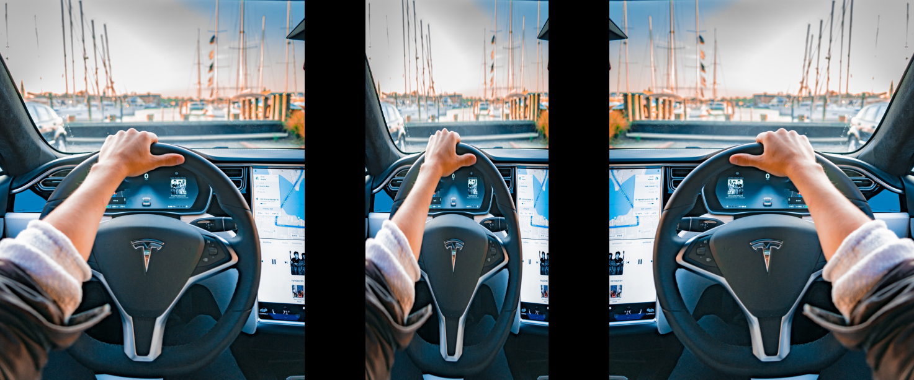

<center><h1>Affine And Projective Transformation</h1></center>

---



---

**Affine transformations=>** We can say that affine transformations are generalizations of **Euclidean transformation**. So first we need to talk about Euclidean transformations, in euclidean transformations geometry of the thing doest't change, lines will remain lines, shape will remain unchanged. It might rotated and shifted, but the basic structure will not change. Unlike Euclidean transformation in affine transformations, squares might become rectangles or parallelogram. Basically, affine transformation don't preserve lengths and angles.

For build a affine transfomation matrix, we need to define the control points. Once we have these control points, we need to decide where we want them to be mapped. In this particular situation, all we need are three points in the source image, and three points in the output image.

We want the three points in org_points to be mapped to the corresponding points in trans_points .

```
# original points of the image
org_points = np.float32([[0,0], [cols-1, 0], [0, rows-1]])
# destinating points for image
trans_points = np.float32([[0,0], [int(0.6*(cols-1)), 0], [int(0.4*(cols-1)), rows-1]])
```
To get the transformation matrix, we have a function called getAffineTransform in OpenCV. Once we have the affine transformation matrix, we use the warpAffine function to apply this matrix to the input image.

```
# initialize affine matrix(for affine transformations)
affine_matrix = cv.getAffineTransform(org_points, trans_points)
parallelogram_image = cv.warpAffine(scaled_img, affine_matrix, (cols,rows))
```

**Output Image**


**Mirro Image=>**

```
# original points will be same
# change the transfomation points(destinatioin points) 
trans_points = np.float32([[cols-1,0], [0,0], [cols-1, rows-1]])
affine_matrix = cv.getAffineTransform(org_points, trans_points)
mirror_image = cv.warpAffine(scaled_img, affine_matrix, (cols, rows))
```

**Output image**


---

**Projective Transformation=>** A projective transformation gives as more freedom. It is also referred to as homography.Projective transformation can be represented as transformation of an arbitrary quadrangle (i.e. system of four points) into another one. We can say that any two images on a given plane are related by a homography. As long as they are in the same plane, we can transform anything into anything else. This has many practical applications such as augmented reality, image rectification, image registration, or the computation of camera motion between two images.


We can choose four control points in the source image and map them to the destination image. Parallel lines will not remain parallel lines after the transformation. We use a function called getPerspectiveTransform to get the transformation matrix.

**Code Example =>**

```
# original points of the image
org_points = np.float32([[0,0], [cols-1, 0], [0, rows-1], [cols-1, rows-1]])
# destinating points for image
trans_points = np.float32([[int(0.2*(cols-1)),0], [int(0.8*(cols-1)), 0], [int(0.2*(cols-1)), rows-1], [int(0.8*(cols-1)),rows-1]])
# initialize projective matrix
projective_matrix = cv.getPerspectiveTransform(org_points, trans_points)
projective_image = cv.warpPerspective(scaled_img, projective_matrix, (cols,rows))
```

**Output image:**


