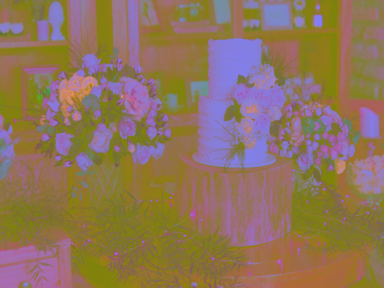
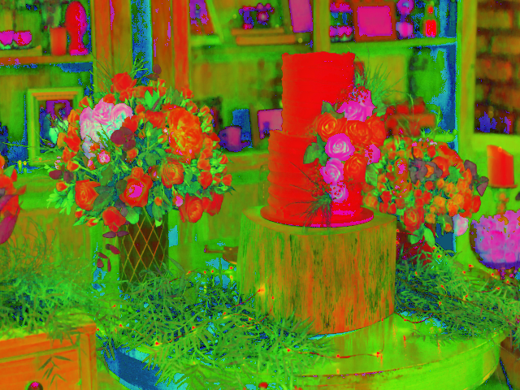
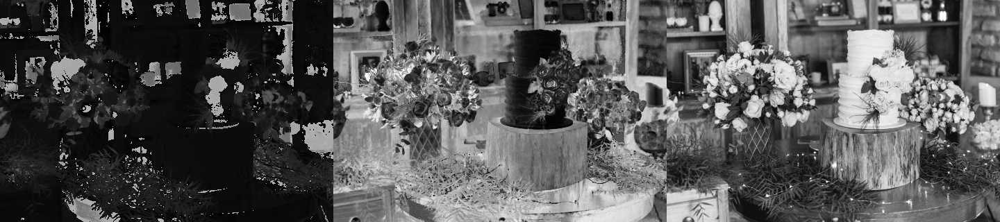
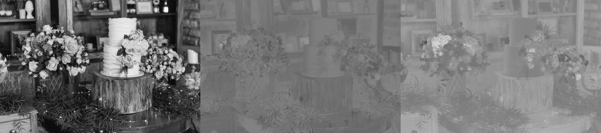
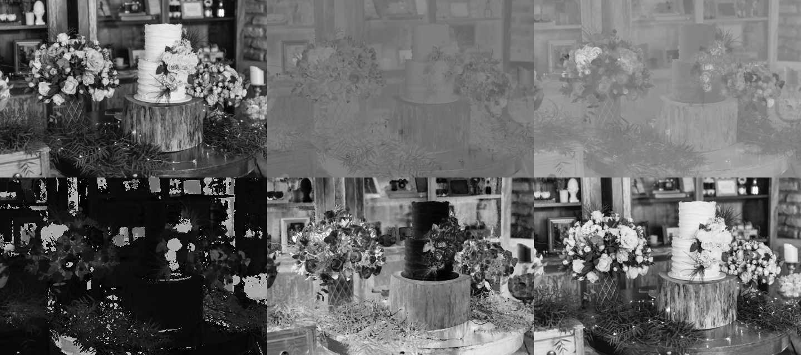

<center><h1>Color spaces</h1></center>

In computer vision and image processing, color space refers to a special way of organizing colors. A color space is actually a combination of two things: a color model and a mapping function The reason we want color models is because it helps us in representing pixel values using tuples. The mapping function maps the color model to the set of all possible colors that can be represented.

In OpenCv there are many different color spaces available, Some of the more popular color spaces are RGB,YUV,HSV and so on.

***RGB=>** Its probably the most popular color space. It stands for red, green and blue. Every pixel value is represented as a tuple of three numbers corresponding to red, green and blue, each value ranges between 0 and 255.

**YUV=>** Even though RGB is good for many purposes, it tends to be very limited for many real life applications. People started thinking about different methods to separate the intensity information from the color information. Hence, they came up with the YUV color space. Y refers to the luminance or intensity, and U/V channels represent color information. This works well in many applications because the human visual system perceives intensity information very differently from color information.

**HSV=>** As it turned out, even YUV was still not good enough for some of the applications. So people started thinking about how humans perceive color and they came up with the HSV color space. HSV stands for Hue, Saturation, and Value. This is a cylindrical system where we separate three of the most primary properties of colors and represent them using different channels. This is closely related to how the human visual system understands color. This gives us a lot of flexibility as to how we can handle images.

---
Convert the images into grayscal image:

``` 
import cv2 as cv
img = cv.imread('../../images/flowers.png')
img_gray = cv.cvtColor(img, cv.COLOR_BGR2GRAY)
cv.imshow('Gray Image', img_gray)
cv.waitKey()
```
**Output image**


---

Convert the images into YUV color space:

```
img_yuv = cv.cvtColor(img,cv.COLOR_BGR2YUV)
```
**Output image**




---

Convert image into HSV color space

```
img_hsv = cv.cvtColor(img, cv.COLOR_BGR2HSV)
```


---

Lets do some fun things and make collage of YUV and HSV color spaces but with separate chennels:

```
#first lets stack the images horizontally by numpy hstack()
horizontal_1 = np.hstack([img_yuv[:,:,0],img_yuv[:,:,1],img_yuv[:,:,2]])
horizontal_2 = np.hstack([img_hsv[:,:,0],img_hsv[:,:,1],img_hsv[:,:,2]])


# Show the final image collage
cv.imshow("Y,U and V chennels", horizontal_1)
cv.imshow("H,S and V chennels", horizontal_2)
```
**HSV collage with H, S and V chennels=>**


**YUV collage with Y, U and V chennels=>**


---

We can stack both image collage on top of each, with the help of numpy **vstack()**, Lets do it.

```
vertical = np.vstack([horizontal_1,horizontal_2])
cv.imshow('YUV and HSV mix collage',vertical)
```
**Output image**


