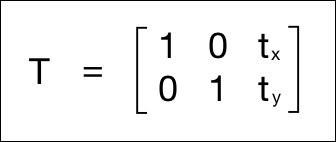
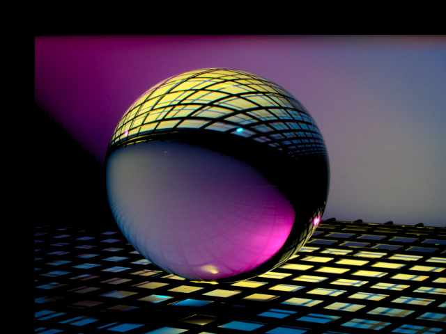
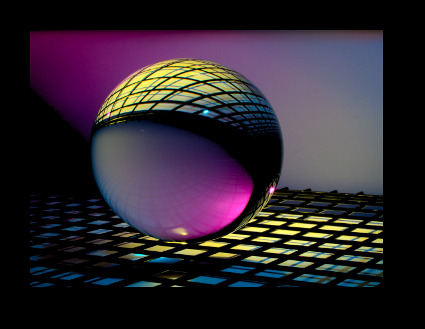
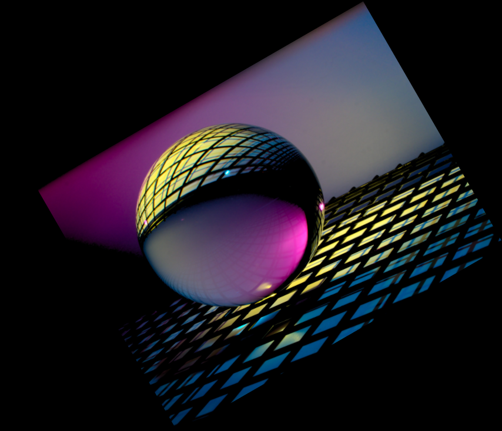

<center><h1>Image Translation, rotation and Scaling.</h1></center>

In this program i used OpenCv library for **image translation** and **scaling**.

**Image Scaling=>** Scaling means resizing an image which means an image is made bigger or smaller in x- or/and  y-direction. I use Opencv's **resize()** for resizing the image, In resize operation there are multiple ways to fill the pixel values, when we are enlarging an image, we need to fill up the pixel values in between pixel location,When we are shrinking the image , we need to take the best represntative value.When we are scaling by a non-integer value, we need to interpolate values appropriately, so that the
quality of the image is maintained.When we enlarging the image we can use linear or cubic interpolation.

In this program i am doing INTER_AREA interpolation for shrinking the image,

```
img_scale = cv.resize(img, (640,480), interpolation=cv.INTER_AREA)
```
---

**Image Translation=>** In image translation the translate function perform a geometric transfromation which maps the position of each image element in an input image into a new position in an output image.


I shift the image by adding/subtracting the X and Y coordinates. In order to do this, I need to create a transformation matrix, as shown as
follows:



Here, translation_mat is used as a translation matrix. and I am shifting the image X=50, and Y = 50 direction.

```
translation_mat = np.float32([[1,0,50], [0,1,50]])
```
So after creating the matrix , I am using the warpAffine function, to apply to image translation.

```
img_translation = cv.warpAffine(img_scale, translation_mat, (num_cols,num_rows))
```


 The image translation function does not increase the frame size, after appling warpAffine image got cropped. For preventing it I applied warpAffine one more time with different translation matrix, and increase the size of frame,

 ```
 translation_matrix = np.float32([[1,0, 0], [0, 1, 0]])
scaled_frame_img = cv.warpAffine(img_translation, translation_matrix, (num_cols + 70, num_rows + 70))
 ```


 ---

**Rotation=>** Rotation is also a form of translation,OpenCv provides closer control over the creation of this matrix through the function, getRotaionMatrix2D.
```
# Create matrix translation_mat for rotation
translation_mat = np.float32([[1,0, int(0.5*num_cols -100)], [0,1,int(0.5*num_rows-185)]])
#Create rotation matrix for give angle and points 
rotation_mat = cv.getRotationMatrix2D((num_cols, num_rows), 30, 1) 
img_trans = cv.warpAffine(img_scale, translation_mat,(2*num_cols,2*num_rows))
# lets make frame bigger
img_rotation = cv.warpAffine(img_trans, rotation_mat, (2*num_cols-426,2*num_rows-226))

```




Here we can specify the point around which the image would be rotated, the angle of rotation in degree, and scaling facetor for image.

